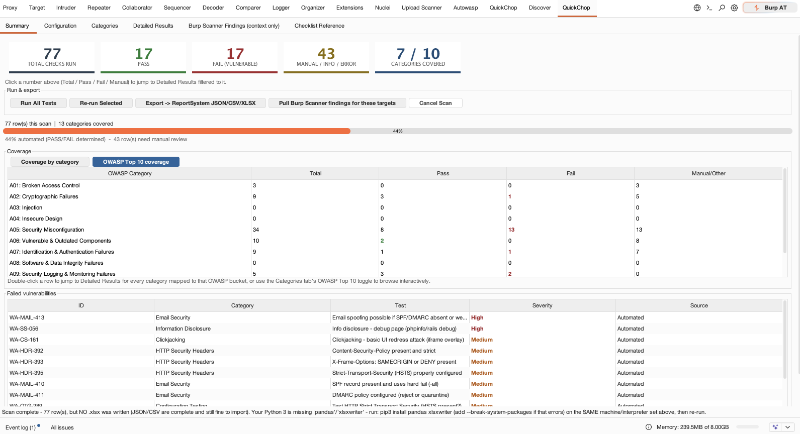
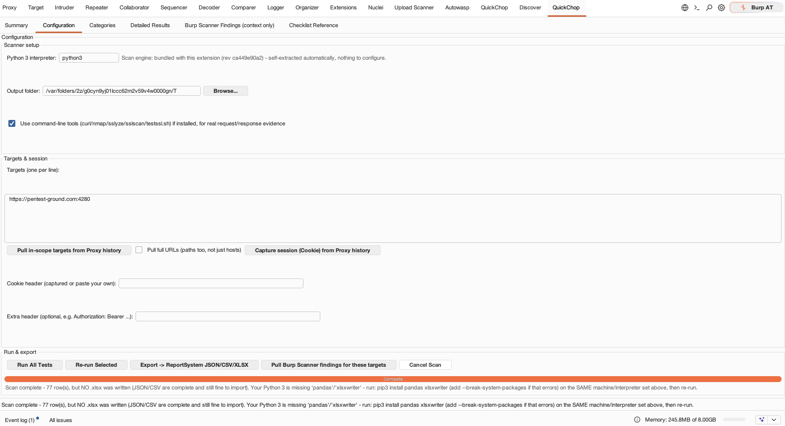
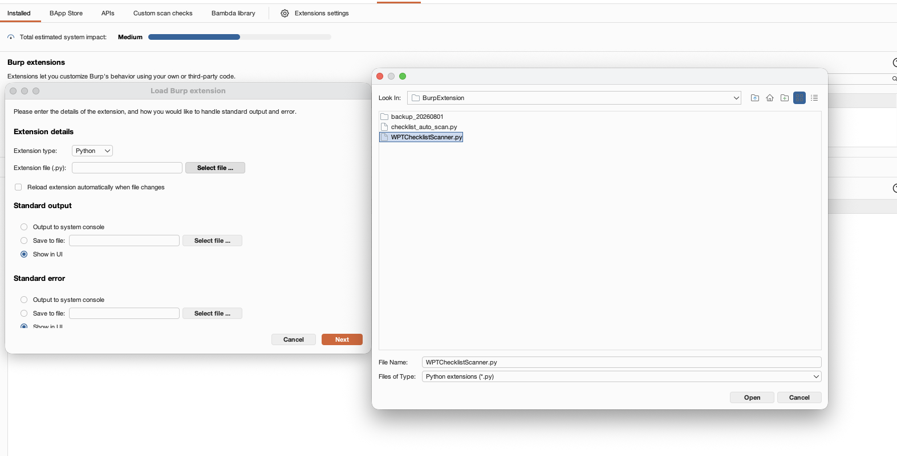
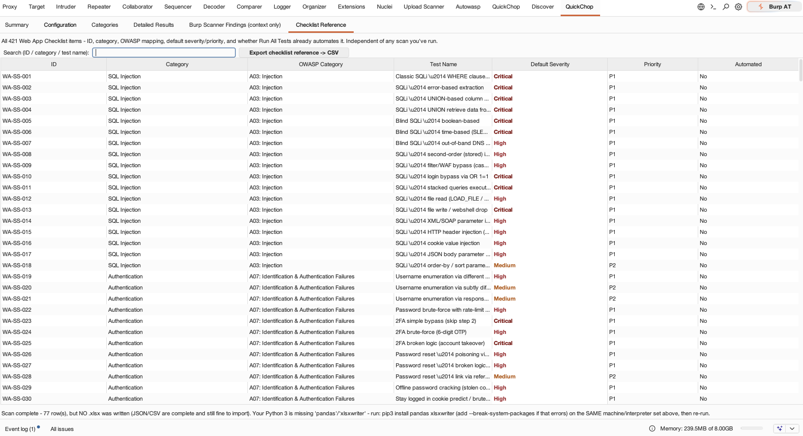
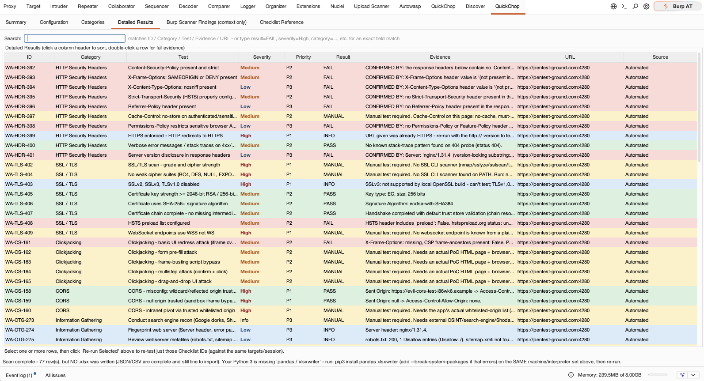
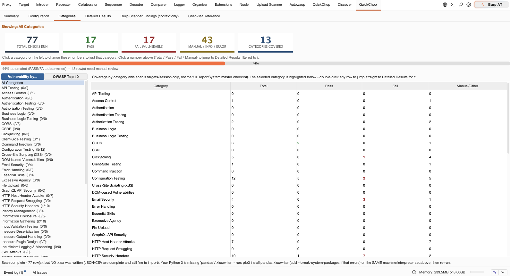
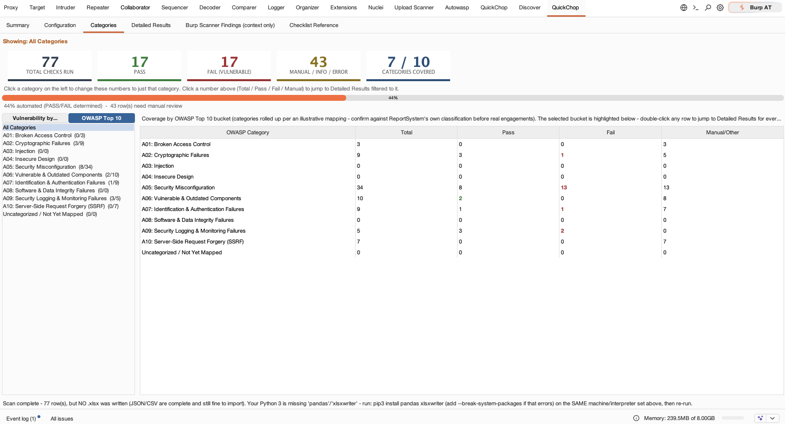

# QuickChop — WPT Checklist Scanner (Burp Suite extension)

QuickChop is a Burp Suite tab that drives Web Application Pentest (WPT) checklist testing straight from a live, authenticated Burp session — instead of maintaining a separate script and manually copy-pasting session cookies.

## What it does

- **Runs ~100 automated, non-destructive checks** from the WPT checklist (HTTP security headers, TLS config, cookies, CORS, clickjacking, email security/SPF-DKIM-DMARC, path/config probes, basic IDOR via force-browse) against whatever you've already browsed through Burp's Proxy — authenticated as you, using the session Cookie/Authorization header it captures directly from Proxy history.
- **Tracks the full ~421-item master checklist**, not just the automated subset. The ~344 items that need active human testing (SQL Injection, XSS, Business Logic, Race Conditions, JWT attacks, etc.) show up as a searchable list so a finding you confirm by hand in Repeater/Intruder/Proxy can be logged against the correct checklist ID via a right-click "Log finding to QuickChop" context menu — giving one combined coverage picture instead of two disconnected trackers.
- **Summarizes and prioritizes results**: category-by-category pass/fail counts, a "Failed vulnerabilities" view sorted Critical → High → Medium → Low with matching accent colors, and a full color-coded results table (PASS/FAIL/MANUAL/INFO/ERROR).
- **Cross-references Burp's own Scanner findings** for the same targets as context while you review (display-only — never merged into checklist data, since Scanner issues don't map to WPT checklist IDs).
- **Exports to JSON/CSV/XLSX** in the exact schema the ReportSystem portal's "Import Auto-Scan Results" page already accepts — no conversion step.

## How it's built

Burp only loads extensions through Jython (Python 2.7, no third-party packages), so `WPTChecklistScanner.py` is a thin Jython UI shell: it builds the Burp tab, pulls targets/session data from Proxy history and scope, then shells out to a real Python 3 interpreter running `checklist_auto_scan.py` (which has the actual check logic and `.xlsx` writer) and renders the JSON it gets back. Nothing about the checklist logic itself lives in Jython.

## Files

| File | Purpose |
|---|---|
| `WPTChecklistScanner.py` | The Burp extension (load this in Burp). |
| `checklist_auto_scan.py` | The scanner Burp shells out to — must sit on the same machine as Burp. |
| `README_BurpExtension.md` | Full install/configuration/troubleshooting guide. |

See [`README_BurpExtension.md`](./README_BurpExtension.md) for setup (Jython jar, loading the extension, configuring targets/session) and the detailed roadmap for closing remaining checklist coverage via Turbo Intruder / Param Miner / sqlmap / Dalfox / jwt_tool / Playwright.

## Screenshots

**Summary dashboard** — total/pass/fail/manual counts, coverage by category or rolled up to the OWASP Top 10, and a severity-sorted list of failed vulnerabilities:

**Configuration** — Python 3 interpreter/output folder, target list, and one-click session capture (targets + Cookie header) straight from Burp's Proxy history:

**Loading the extension in Burp** (Extensions → Installed → Add → Python → select `WPTChecklistScanner.py`):

**Checklist Reference** — all 421 Web App Checklist items with OWASP category mapping, default severity/priority, and whether it's automated yet:

**Detailed Results** — every check run, color-coded by result (PASS/FAIL/MANUAL/INFO), with the evidence and URL for each row:

**Categories — by category / OWASP Top 10** — coverage rolled up either by native checklist category or by OWASP Top 10 bucket:

## Status

Not yet covered by automation: SQL Injection, XSS, HTTP Request Smuggling, CSRF (beyond token-presence), SSRF, XXE, Command Injection, Path Traversal, Race Conditions, Web Cache Poisoning, Business Logic, JWT Attacks — tracked in the master checklist for manual logging, planned for tool-assisted automation in later phases (see roadmap in `README_BurpExtension.md`).
